<h1 style="text-align:center; font-size:40px; color:inherit">Application of a genetic algorithm on a Neural Network using Tensorflow<span style="font-size: 25px"> <br/>–<br/>Malware detection with Machine Learning</span></h1>

<p style="text-align:center;"><br/>Author: <strong>François Andrieux</strong></p>

<h1>Table of Contents<span class="tocSkip"></span></h1>
<div class="toc"><ul class="toc-item"><li><span><a href="#Import-the-dataset" data-toc-modified-id="Import-the-dataset-1"><span class="toc-item-num">1&nbsp;&nbsp;</span>Import the dataset</a></span></li><li><span><a href="#Analysis-of-the-data" data-toc-modified-id="Analysis-of-the-data-2"><span class="toc-item-num">2&nbsp;&nbsp;</span>Analysis of the data</a></span></li><li><span><a href="#Cross-validation-datasets-creation" data-toc-modified-id="Cross-validation-datasets-creation-3"><span class="toc-item-num">3&nbsp;&nbsp;</span>Cross validation datasets creation</a></span><ul class="toc-item"><li><span><a href="#Analysis-of-the-malware/benign-distribution" data-toc-modified-id="Analysis-of-the-malware/benign-distribution-3.1"><span class="toc-item-num">3.1&nbsp;&nbsp;</span>Analysis of the malware/benign distribution</a></span></li></ul></li><li><span><a href="#Build-the-model" data-toc-modified-id="Build-the-model-4"><span class="toc-item-num">4&nbsp;&nbsp;</span>Build the model</a></span></li><li><span><a href="#The-training-part" data-toc-modified-id="The-training-part-5"><span class="toc-item-num">5&nbsp;&nbsp;</span>The training part</a></span></li><li><span><a href="#Genetic-algorithm-configuration" data-toc-modified-id="Genetic-algorithm-configuration-6"><span class="toc-item-num">6&nbsp;&nbsp;</span>Genetic algorithm configuration</a></span><ul class="toc-item"><li><span><a href="#Configure-the-hyperparameters-that-can-be-changed" data-toc-modified-id="Configure-the-hyperparameters-that-can-be-changed-6.1"><span class="toc-item-num">6.1&nbsp;&nbsp;</span>Configure the hyperparameters that can be changed</a></span></li><li><span><a href="#Configure-the-fitness-function" data-toc-modified-id="Configure-the-fitness-function-6.2"><span class="toc-item-num">6.2&nbsp;&nbsp;</span>Configure the fitness function</a></span></li><li><span><a href="#Define-the-callback-function" data-toc-modified-id="Define-the-callback-function-6.3"><span class="toc-item-num">6.3&nbsp;&nbsp;</span>Define the callback function</a></span></li></ul></li><li><span><a href="#Launch-the-genetic-evolution" data-toc-modified-id="Launch-the-genetic-evolution-7"><span class="toc-item-num">7&nbsp;&nbsp;</span>Launch the genetic evolution</a></span><ul class="toc-item"><li><span><a href="#Create-the-initial-population" data-toc-modified-id="Create-the-initial-population-7.1"><span class="toc-item-num">7.1&nbsp;&nbsp;</span>Create the initial population</a></span></li><li><span><a href="#Evolve-the-population" data-toc-modified-id="Evolve-the-population-7.2"><span class="toc-item-num">7.2&nbsp;&nbsp;</span>Evolve the population</a></span></li><li><span><a href="#Display-the-best-player-in-the-game" data-toc-modified-id="Display-the-best-player-in-the-game-7.3"><span class="toc-item-num">7.3&nbsp;&nbsp;</span>Display the best player in the game</a></span></li><li><span><a href="#Analyze-how-parameters-influences" data-toc-modified-id="Analyze-how-parameters-influences-7.4"><span class="toc-item-num">7.4&nbsp;&nbsp;</span>Analyze how parameters influences</a></span></li></ul></li><li><span><a href="#Final-training-on-the-entire-dataset" data-toc-modified-id="Final-training-on-the-entire-dataset-8"><span class="toc-item-num">8&nbsp;&nbsp;</span>Final training on the entire dataset</a></span><ul class="toc-item"><li><span><a href="#Launch-the-training" data-toc-modified-id="Launch-the-training-8.1"><span class="toc-item-num">8.1&nbsp;&nbsp;</span>Launch the training</a></span></li><li><span><a href="#Analysis-of-the-results" data-toc-modified-id="Analysis-of-the-results-8.2"><span class="toc-item-num">8.2&nbsp;&nbsp;</span>Analysis of the results</a></span></li><li><span><a href="#Limitations-of-the-genetic-evolution" data-toc-modified-id="Limitations-of-the-genetic-evolution-8.3"><span class="toc-item-num">8.3&nbsp;&nbsp;</span>Limitations of the genetic evolution</a></span></li><li><span><a href="#Possible-improvements" data-toc-modified-id="Possible-improvements-8.4"><span class="toc-item-num">8.4&nbsp;&nbsp;</span>Possible improvements</a></span></li></ul></li></ul></div>

The goal of this notebook is to achieve a **classification** in order to **detect Android malwares**. The process will be to feed forward an **Artificial Neural Network** with a pre-processed and clean dataset of Java Bytecode, and predict if it is **benign or not**. 

Then, we apply a **genetic algorithm** with the aim of getting the most optimized parameters for the neural network. The genetic algorithm implementation is located as an external python module in `genev.py`. 


```python
%reset -f # reset all variables
```

> **Tensorflow** will be used for building and training the neural network,  
> **Pandas** for the first data processing and visualization,   
> **Matplotlib** (with **Seaborn backend**) will be used to plot the results of the ANN


```python
import genev # genetic algorithm
from genev import Individual, Evolution

import os
import sys
import time
import math
import seaborn as sns
import numpy as np
import pandas as pd
import matplotlib.pyplot as plt
import tensorflow as tf

from sklearn.utils import shuffle
from datetime import timedelta
from numpy import linalg as LA
from IPython.display import SVG, display

sns.set()   # Set seaborn as backend
os.environ["TF_CPP_MIN_LOG_LEVEL"] = "2"  # Hide messy TensorFlow warnings
%matplotlib inline
%config InlineBackend.figure_format = "retina" # Enhance matplotlib on hdpi displays
%autonotify --after 30
```

## Import the dataset
The dataset contains supposedly contains **5541** Android Malwares and **2166** benign applications. The input/output shape for each item is **5971/2**. 


```python
path = "./android-features.data"
```


```python
count = 0
_samples = None
_input_size, _output_size = None, None 
_raw_inputs, _raw_outputs = [], []

with open(path) as f:
    for line in f:
        
        count += 1
        
        # Parse string data to float
        data = [float(i) for i in line.split()]
        
        # Read header
        if _samples is None:
            _samples = int(data[0])
            _input_size = int(data[1])
            _output_size = int(data[2])
            continue
            
        if count % 2 == 0:
            _raw_inputs.append(data)
        else:
            _raw_outputs.append(data)
        
_raw_inputs = np.asarray(_raw_inputs)
_raw_outputs = np.asarray(_raw_outputs)
```

Check that we correctly have the right shapes of data. The shapes of the array will confirm us if we loaded correctly all data:


```python
print("_samples", _samples)
print("_input_size", _input_size)
print("_output_size", _output_size)
print("_raw_inputs.shape", _raw_inputs.shape)
print("_raw_outputs.shape", _raw_outputs.shape)
```

    _samples 7707
    _input_size 5971
    _output_size 2
    _raw_inputs.shape (7707, 5971)
    _raw_outputs.shape (7707, 2)
    

## Analysis of the data
Our objective is to get knowledge about the data that we manipulate and, for example, verify that the inputs are **normalized** as well as the outputs. 


```python
df = pd.DataFrame(_raw_inputs)
df.head()
```


<div>
<style scoped>
    .dataframe tbody tr th:only-of-type {
        vertical-align: middle;
    }

    .dataframe tbody tr th {
        vertical-align: top;
    }

    .dataframe thead th {
        text-align: right;
    }
</style>
<table border="1" class="dataframe">
  <thead>
    <tr style="text-align: right;">
      <th></th>
      <th>0</th>
      <th>1</th>
      <th>2</th>
      <th>3</th>
      <th>4</th>
      <th>5</th>
      <th>6</th>
      <th>7</th>
      <th>8</th>
      <th>9</th>
      <th>...</th>
      <th>5961</th>
      <th>5962</th>
      <th>5963</th>
      <th>5964</th>
      <th>5965</th>
      <th>5966</th>
      <th>5967</th>
      <th>5968</th>
      <th>5969</th>
      <th>5970</th>
    </tr>
  </thead>
  <tbody>
    <tr>
      <th>0</th>
      <td>0.000000</td>
      <td>0.00000</td>
      <td>0.000275</td>
      <td>0.0</td>
      <td>0.000000</td>
      <td>0.000000</td>
      <td>0.0</td>
      <td>0.000000</td>
      <td>0.000000</td>
      <td>0.000000</td>
      <td>...</td>
      <td>0.029498</td>
      <td>0.061378</td>
      <td>0.033071</td>
      <td>0.036460</td>
      <td>0.050385</td>
      <td>0.106724</td>
      <td>0.041774</td>
      <td>0.135672</td>
      <td>0.058721</td>
      <td>0.037651</td>
    </tr>
    <tr>
      <th>1</th>
      <td>0.000000</td>
      <td>0.00000</td>
      <td>0.000000</td>
      <td>0.0</td>
      <td>0.000335</td>
      <td>0.000000</td>
      <td>0.0</td>
      <td>0.000000</td>
      <td>0.000000</td>
      <td>0.000000</td>
      <td>...</td>
      <td>0.025469</td>
      <td>0.083780</td>
      <td>0.031166</td>
      <td>0.036528</td>
      <td>0.061662</td>
      <td>0.105228</td>
      <td>0.054960</td>
      <td>0.171917</td>
      <td>0.057306</td>
      <td>0.045576</td>
    </tr>
    <tr>
      <th>2</th>
      <td>0.000013</td>
      <td>0.00009</td>
      <td>0.000000</td>
      <td>0.0</td>
      <td>0.000013</td>
      <td>0.000013</td>
      <td>0.0</td>
      <td>0.000013</td>
      <td>0.000013</td>
      <td>0.000000</td>
      <td>...</td>
      <td>0.031334</td>
      <td>0.047353</td>
      <td>0.035140</td>
      <td>0.029078</td>
      <td>0.022517</td>
      <td>0.110379</td>
      <td>0.039792</td>
      <td>0.138919</td>
      <td>0.041612</td>
      <td>0.026272</td>
    </tr>
    <tr>
      <th>3</th>
      <td>0.000018</td>
      <td>0.00000</td>
      <td>0.000055</td>
      <td>0.0</td>
      <td>0.000000</td>
      <td>0.000009</td>
      <td>0.0</td>
      <td>0.000009</td>
      <td>0.000018</td>
      <td>0.000046</td>
      <td>...</td>
      <td>0.035820</td>
      <td>0.081835</td>
      <td>0.022787</td>
      <td>0.031889</td>
      <td>0.044527</td>
      <td>0.092903</td>
      <td>0.033469</td>
      <td>0.100370</td>
      <td>0.043728</td>
      <td>0.023393</td>
    </tr>
    <tr>
      <th>4</th>
      <td>0.000011</td>
      <td>0.00008</td>
      <td>0.000023</td>
      <td>0.0</td>
      <td>0.000011</td>
      <td>0.000011</td>
      <td>0.0</td>
      <td>0.000011</td>
      <td>0.000023</td>
      <td>0.000000</td>
      <td>...</td>
      <td>0.030828</td>
      <td>0.046942</td>
      <td>0.037359</td>
      <td>0.027488</td>
      <td>0.022576</td>
      <td>0.104237</td>
      <td>0.042742</td>
      <td>0.133000</td>
      <td>0.039941</td>
      <td>0.025916</td>
    </tr>
  </tbody>
</table>
<p>5 rows × 5971 columns</p>
</div>


```python
df = pd.DataFrame(_raw_outputs)
df.head()
```


<div>
<style scoped>
    .dataframe tbody tr th:only-of-type {
        vertical-align: middle;
    }

    .dataframe tbody tr th {
        vertical-align: top;
    }

    .dataframe thead th {
        text-align: right;
    }
</style>
<table border="1" class="dataframe">
  <thead>
    <tr style="text-align: right;">
      <th></th>
      <th>0</th>
      <th>1</th>
    </tr>
  </thead>
  <tbody>
    <tr>
      <th>0</th>
      <td>0.95</td>
      <td>0.05</td>
    </tr>
    <tr>
      <th>1</th>
      <td>0.95</td>
      <td>0.05</td>
    </tr>
    <tr>
      <th>2</th>
      <td>0.95</td>
      <td>0.05</td>
    </tr>
    <tr>
      <th>3</th>
      <td>0.95</td>
      <td>0.05</td>
    </tr>
    <tr>
      <th>4</th>
      <td>0.95</td>
      <td>0.05</td>
    </tr>
  </tbody>
</table>
</div>


## Cross validation datasets creation
As we can see above, the data is not equally divided in the dataset: it is sorted by class (malware first, benign last).   
Thus, we can start by **shuffling the dataset**:


```python
X_all, y_all = shuffle(_raw_inputs, _raw_outputs, random_state=0)
```

For performance purpose, we will take only **10% of the dataset** in order to speedup the overall  process. 


```python
# part = 0.1 # take a small part
part = 1.0 # when we're done with testing
size = X_all.shape[0]

X_data = X_all[: int(size * part)]
y_data = y_all[: int(size * part)]
```

Then, we need to split it 3 parts with 3 different purpose: 
- The **training dataset** - 60% (*gain knowledge*)
- The **validation dataset** - 20% (*validate the ability of generalizing*)
- The **test dataset** - 20% (*test the accuracy*)   


```python
def cross_validation_split(X, y):
    validation_part = 0.20
    test_part = 0.20
    train_part = 1 - validation_part - test_part

    size = X.shape[0]

    # Create cross-validation datasets
    X_train = X[: int(size * train_part)]
    y_train = y[: int(size * train_part)]

    X_val = X[X_train.shape[0]: X_train.shape[0] + int(size * validation_part)]
    y_val = y[y_train.shape[0]: y_train.shape[0] + int(size * validation_part)]

    X_test = X[-int(size * test_part):]
    y_test = y[-int(size * test_part):]

    print("X_.shape\t", X.shape, "\t", "y_.shape\t", y.shape)
    print("X_train.shape\t", X_train.shape, "\t", "y_train.shape\t", y_train.shape)
    print("X_val.shape\t", X_val.shape, "\t", "y_val.shape\t", y_val.shape)
    print("X_test.shape\t", X_test.shape, "\t", "y_test.shape\t", y_test.shape)
    
    return X_train, y_train, X_val, y_val, X_test, y_test

X_train, y_train, X_val, y_val, X_test, y_test = cross_validation_split(X_data, y_data)
```

    X_.shape	 (7707, 5971) 	 y_.shape	 (7707, 2)
    X_train.shape	 (4624, 5971) 	 y_train.shape	 (4624, 2)
    X_val.shape	 (1541, 5971) 	 y_val.shape	 (1541, 2)
    X_test.shape	 (1541, 5971) 	 y_test.shape	 (1541, 2)
    

### Analysis of the malware/benign distribution
Now that we have shuffled our data and splitted our data, we need to check that it is correctly distributed:


```python
def frame(dataset, label):
    
    df = pd.DataFrame(dataset)
    columns = [() for _ in range(df.shape[1])]
    values = [None for _ in range(df.shape[1])]

    for n in df:
        for i, item in enumerate(df[n].value_counts().items()):
            columns[i] += (item[0],)
            values[i] = item[1]

    df = pd.DataFrame([values], index=[label], columns=columns)
    return df
    
df1 = frame(y_data, "y_data")
df2 = frame(y_train, "y_train")
df3 = frame(y_val, "y_val")
df4 = frame(y_test, "y_test")

df = pd.concat([df1, df2, df3, df4])
display(df)

hist = df.plot.bar(rot=0, figsize=(10, 4))
hist.set_title("Distribution in of malware/benign")
plt.show()
```


<div>
<style scoped>
    .dataframe tbody tr th:only-of-type {
        vertical-align: middle;
    }

    .dataframe tbody tr th {
        vertical-align: top;
    }

    .dataframe thead th {
        text-align: right;
    }
</style>
<table border="1" class="dataframe">
  <thead>
    <tr style="text-align: right;">
      <th></th>
      <th>(0.95, 0.05)</th>
      <th>(0.05, 0.95)</th>
    </tr>
  </thead>
  <tbody>
    <tr>
      <th>y_data</th>
      <td>5541</td>
      <td>2166</td>
    </tr>
    <tr>
      <th>y_train</th>
      <td>3337</td>
      <td>1287</td>
    </tr>
    <tr>
      <th>y_val</th>
      <td>1102</td>
      <td>439</td>
    </tr>
    <tr>
      <th>y_test</th>
      <td>1101</td>
      <td>440</td>
    </tr>
  </tbody>
</table>
</div>


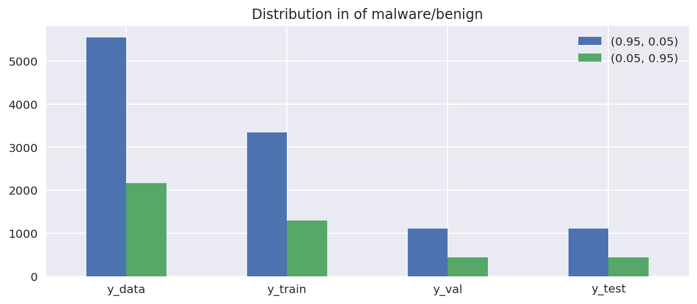


Thanks to this histogram, we are now sure that each set is representative of our global data.

## Build the model

<a style="float:right" href="https://en.wikipedia.org/wiki/Sensitivity_and_specificity#/media/File:Sensitivity_and_specificity.svg">"Sensitivity and specificity", from Wikipedia</a>
As well as we do a classification, the purpose of the test dataset is to ensure that the classification is correct.  
The following is implemented under `Model.test(, X, Y)`

> **True positive** (TP): correctly identified   
    *We predicted "malware" and the true class is "malware"*  

> **False positive** (FP): incorrectly identified   
    *We predicted "not malware" and the true class is "not malware"*
        
> **True negative** (TN): correctly rejected    
    *We predicted "malware" and the true class is "not malware"*

> **False negative** (FN): incorrectly rejected     
    *We predicted "not malware" and the true class is "malware"*
    
The following measures can be calculated:
* **Accuracy**
* **Misclassification Error** (or Error Rate)
* **Receiver Operating Characteristic** (ROC)

More info on http://mlwiki.org/index.php/Evaluation_of_Binary_Classifiers#Accuracy_and_Error_Rate   

We decide to classify the neural network output as a malware if its output 0 is greater than the output 1.    
The following function illustrates that, given a `tuple` as parameter:


```python
def is_malware(value : tuple):
    return True if value[0] > value[1] else False # ex: 0.91 > 0.12 means it is categorized as a malware
```

We register the model as a class in order to produce as many copies of this model as we want for soon generating each population of a our genetic algorithm.   
Here are most important methods:
* `__init__()` take all hyperparameters that will be dynamically modified by the genetic algorithm as arguments
* `build()` creates the Tensorflow graph given the model's hyperparameters
* `train_on_batch()` optimizes the internal weights of the model given the data and the `batch_size` (it can be 1)
* `validate_on_batch()` returns metrics of the current model tested on the given data and the batch size
* `fit()` calls `train_on_batch()` on the whole training set and validate its performance on the validation set each `epochs_between_reports`
* `test()` return metrics of the current model tested on the test set


```python
class Model():

    def __init__(self, learning_rate=0.01, momentum=0.9, lr_decay=0.0, hidden_layers=1, hidden_size=1, activation="linear"):
        
        self.learning_rate = learning_rate
        self.momentum = momentum
        self.lr_decay = lr_decay
        self.hidden_layers = hidden_layers
        self.hidden_size = hidden_size
        self.activation = activation
        
        self.train_losses = []
        self.validation_losses = []
        self.metrics = []
        self.times = []
        self.training_time = None

        self.status = "live" # other values are messages
        self.aborted = False
        self.epochs_between_reports = 10
        self.desired_error = 0.001
        
        # Initialize session
        self.build(X_data.shape[1], y_data.shape[1])
        
    def build(self, input_shape, output_shape):
        
        tf.reset_default_graph()
        self.graph = tf.Graph()
        
        if self.hidden_layers < 0:
            self.status = "not_suitable"
            self.aborted = True
            return 

        with self.graph.as_default():
            with tf.variable_scope("Core_layers"):

                # Pick between available activations
                activations = {"linear": None, "sigmoid": tf.nn.sigmoid, "tanh": tf.nn.tanh, "relu": tf.nn.relu}
                activation = activations[self.activation]
                
                # Input dense layer
                x = tf.placeholder(tf.float32, shape=(None, input_shape))
                y = tf.placeholder(tf.float32, shape=(None, output_shape))

                if self.hidden_layers == 0:
                    output = tf.layers.dense(inputs=x, units=output_shape, activation=activation)
                else:
                    layers = [tf.layers.dense(inputs=x, units=self.hidden_size, activation=activation)]
                
                    # Hidden layers
                    for i in range(self.hidden_layers-1):
                        layers.append(tf.layers.dense(inputs=layers[-1], units=self.hidden_size, activation=activation))

                    # Output layer 
                    output = tf.layers.dense(inputs=layers[-1], units=output_shape, activation=activation)

                # Loss function (MSE)
                loss = tf.losses.mean_squared_error(labels=y, predictions=output)

                # Optimize the loss minimization
                optimizer = tf.train.RMSPropOptimizer(self.learning_rate, momentum=self.momentum, decay=self.lr_decay)
                #optimizer = tf.train.GradientDescentOptimizer(self.learning_rate)
                train_op = optimizer.minimize(loss)

                # Add variables as params to be accessible in the whole object
                self.x = x
                self.y = y
                self.output = output
                self.loss = loss
                self.train_op = train_op
                self.sess = tf.Session()

                assert loss.graph is self.graph
            
    def train_on_batch(self, X, Y, batch_size=None, train=True):
        
        dataset_size = X.shape[0]
        batch_size = dataset_size if batch_size is None else batch_size

        assert batch_size > 0 and batch_size <= dataset_size, \
            "The batch size must be either None or an integer between zero and the dataset size (batch_size={})".format(batch_size)
        
        with self.graph.as_default():
            
            # Get variables from the building
            x, y = self.x, self.y
            loss, train_op = self.loss, self.train_op
            
            # Compute dataset windows corresponding to the batch size
            windows = zip(range(0, dataset_size, batch_size), range(batch_size, dataset_size+1, batch_size))

            start_time = time.time()
            losses = []

            # Fetch by window of dataset[start:end]
            for start, end in windows:
                
                loss_t = self.sess.run([loss, train_op] if train is True else [loss], {x: X, y: Y})
                
                if not np.isfinite(loss_t[0]):
                    self.status = "stopped: the loss is gone to infinite values"
                    self.aborted = True
                    break
                    
                losses.append(loss_t[0])

            # Return the mean loss and elapsed time for this epoch    
            return np.mean(losses), time.time() - start_time     
        
    def validate_on_batch(self, X, Y, batch_size=1):
        
        # Call train function but with train=False option
        return self.train_on_batch(X, Y, batch_size, train=False)
    
    def fit(self, X_train, Y_train, X_validation, Y_validation, X_test, Y_test, epochs, batch_size=None, early_stopping=True, verbose=False):

        if epochs % self.epochs_between_reports != 0:
            print("Warning: it is recommended to set a number of `epochs` divisible by the `epochs_between_reports`")
        
        with self.graph.as_default():

            train_losses = []
            validation_losses = []
            metrics = []
            times = []
            
            # Initialize weights and biais
            self.sess.run(tf.global_variables_initializer())

            # Fetch the dataset through epochs
            for i in range(1, epochs+1):

                # Train & save metrics
                loss, t = self.train_on_batch(X_train, Y_train, batch_size)
                train_losses.append(loss)
                times.append(t)
                
                if self.aborted:
                    break

                # Validate, test and fire early stopping if necessary
                if i % self.epochs_between_reports == 0:

                    # Validate
                    val_loss, t = self.validate_on_batch(X_validation, Y_validation, batch_size)
                    validation_losses.append(val_loss)
                    
                    # Test and save metrics
                    test_metrics = self.test(X_test, Y_test)
                    acc = test_metrics["accuracy"]
                    metrics.append(test_metrics)
                    
                    # Early Stopping
                    if early_stopping:
                        if len(validation_losses) > 2 and val_loss > validation_losses[-2]:
                            self.status = "early_stopped: val_loss gone up"
                            self.aborted = True
                        if val_loss < self.desired_error:
                            self.status = "early_stopped: desired error reached"
                            sefl.aborted = True
                        
                    if verbose is True:
                        print("epoch #{0:}\tloss: {1:.4f} / {2:.4f}\tacc: {3:.2f}".format(i, loss, val_loss, acc))
                    
            # Save the metrics
            self.train_losses = np.asarray(train_losses)
            self.validation_losses = np.asarray(validation_losses)
            self.metrics = np.asarray(metrics)
            self.times = np.asarray(times)
            self.training_time = np.sum(times)

            return self.train_losses, self.validation_losses, self.metrics, self.times
    
    def test(self, X, Y):
        
        with self.graph.as_default():
            classes = [(0.95, 0.05), (0.05, 0.95)]
        
            # Predict
            predicted = self.sess.run([self.output], {self.x: X})
            predicted = np.asarray(predicted[0])
            expected = Y

            # Establish the count of TP, TN, FP, FN
            TP, TN, FP, FN = 0, 0, 0, 0
            n_malwares = 0
            for pred, exp in zip(predicted, expected):
                n_malwares += 1 if is_malware(exp) else 0
                TP += 1 if is_malware(pred) and is_malware(exp) else 0
                TN += 1 if not is_malware(pred) and not is_malware(exp) else 0
                FP += 1 if is_malware(pred) and not is_malware(exp) else 0
                FN += 1 if not is_malware(pred) and is_malware(exp) else 0
                
            # Compute the rates
            accuracy = (TP + TN) / len(expected)
            error = 1 - accuracy
            TPR = TP / (TP + FN)
            FPR = FP / (FP + TN)
                
            return {
                "accuracy": accuracy,
                "error": error,
                "true_positive": TP,
                "true_negative": TN,
                "true_positive_rate": TPR,
                "false_positive": FP,
                "false_negative": FN,
                "false_positive_rate": FPR
            }
            
    def display_losses(self, figsize=(12, 4)):
        
        train, val = np.asarray(self.train_losses), np.asarray(self.validation_losses)
        fig, (ax1, ax2) = plt.subplots(1, 2, figsize=figsize)

        x_axis = np.arange(len(val))/float(len(val)-1)*(len(train)-1)

        for ax in (ax1, ax2):
            data = [train, val] if ax == ax1 else [np.log(train), np.log(val)]
            ax.plot(data[0], label="Train")
            ax.plot(x_axis, data[1], label="Validation")
            ax.set_xlabel("Epoch")
            ax.set_ylabel("Loss")

        plt.suptitle("model losses after {}s".format(str(timedelta(seconds=self.training_time))), fontsize=16, y=1.10)
        plt.legend()
        plt.tight_layout()
        plt.show()
        
    def display_metrics(self, figsize=(8, 4)):
        
        acc = np.asarray([m["accuracy"] for m in self.metrics])
        
        # We also add the points (0, 0) and (1, 1)
        fpr = np.asarray([0, 1] + [m["false_positive_rate"] for m in self.metrics])
        tpr = np.asarray([0, 1] + [m["true_positive_rate"] for m in self.metrics])
        
        # Sort fpr
        p = fpr.argsort()
        fpr, tpr = fpr[p], tpr[p]
        
        fig, (ax1, ax2) = plt.subplots(1, 2, figsize=figsize, sharey=True)
        ax1.plot(acc, label="accuracy", color="orange")
        ax1.set_xlabel("Epoch")
        ax1.set_ylabel("Accuracy")
        
        ax2.plot([0, 1], [0, 1], "--", color="gray")
        ax2.plot(fpr, tpr, "-r", zorder=1)
        ax2.scatter(fpr, tpr, marker=",", label="tpr/fpr", color=(0.8, 0, 0), s=10, zorder=2)
        ax2.set_xlabel("False Positive Rate")
        ax2.set_ylabel("True Positive Rate")
        
        plt.suptitle("metrics after {}s".format(str(timedelta(seconds=self.training_time))), fontsize=16, y=1.10)
        plt.legend()
        plt.tight_layout()
        plt.show()
        
    def free(self):
        with self.graph.as_default():
            self.sess.close()    
        
    def __delete__(self):
        self.free()
```

## The training part
At this point, we can create a model given the right parameters and test its performance.


```python
params = {'activation': 'tanh',
          'hidden_layers': 3,
          'hidden_size': 9,
          'learning_rate': 0.0028803199879704213,
          'lr_decay': 0.06169868522111648,
          'momentum': 0.4612098539149855}
```


```python
m1 = Model(**params)
m1.epochs_between_reports = 20
```

Train the model. For a more precise result, `batch_size=1` is better. For a quick result, `batch_size=None` will proceed the whole passed data as a batch.


```python
train_losses, val_loss, metrics, t = m1.fit(X_train, y_train, X_val, y_val, X_test, y_test, epochs=1000, batch_size=None, early_stopping=False, verbose=True)
```

    epoch #20	loss: 0.1115 / 0.1091	acc: 0.84
    epoch #40	loss: 0.0726 / 0.0788	acc: 0.90
    epoch #60	loss: 0.0631 / 0.0715	acc: 0.92
    epoch #80	loss: 0.0572 / 0.0665	acc: 0.93
    epoch #100	loss: 0.0526 / 0.0624	acc: 0.94
    epoch #120	loss: 0.0489 / 0.0589	acc: 0.94
    epoch #140	loss: 0.0457 / 0.0559	acc: 0.95
    epoch #160	loss: 0.0429 / 0.0531	acc: 0.95
    epoch #180	loss: 0.0404 / 0.0507	acc: 0.95
    epoch #200	loss: 0.0383 / 0.0486	acc: 0.96
    epoch #220	loss: 0.0364 / 0.0467	acc: 0.96
    epoch #240	loss: 0.0347 / 0.0450	acc: 0.96
    epoch #260	loss: 0.0332 / 0.0435	acc: 0.96
    epoch #280	loss: 0.0319 / 0.0422	acc: 0.96
    epoch #300	loss: 0.0307 / 0.0409	acc: 0.96
    epoch #320	loss: 0.0295 / 0.0398	acc: 0.96
    epoch #340	loss: 0.0285 / 0.0387	acc: 0.96
    epoch #360	loss: 0.0275 / 0.0377	acc: 0.96
    epoch #380	loss: 0.0266 / 0.0368	acc: 0.96
    epoch #400	loss: 0.0258 / 0.0360	acc: 0.96
    epoch #420	loss: 0.0251 / 0.0352	acc: 0.97
    epoch #440	loss: 0.0243 / 0.0345	acc: 0.97
    epoch #460	loss: 0.0236 / 0.0338	acc: 0.97
    epoch #480	loss: 0.0229 / 0.0331	acc: 0.97
    epoch #500	loss: 0.0222 / 0.0325	acc: 0.97
    epoch #520	loss: 0.0216 / 0.0318	acc: 0.97
    epoch #540	loss: 0.0209 / 0.0313	acc: 0.97
    epoch #560	loss: 0.0203 / 0.0307	acc: 0.97
    epoch #580	loss: 0.0197 / 0.0302	acc: 0.97
    epoch #600	loss: 0.0191 / 0.0296	acc: 0.97
    epoch #620	loss: 0.0185 / 0.0291	acc: 0.97
    epoch #640	loss: 0.0179 / 0.0286	acc: 0.97
    epoch #660	loss: 0.0173 / 0.0281	acc: 0.97
    epoch #680	loss: 0.0167 / 0.0277	acc: 0.97
    epoch #700	loss: 0.0161 / 0.0272	acc: 0.97
    epoch #720	loss: 0.0156 / 0.0268	acc: 0.97
    epoch #740	loss: 0.0150 / 0.0264	acc: 0.97
    epoch #760	loss: 0.0144 / 0.0259	acc: 0.97
    epoch #780	loss: 0.0138 / 0.0255	acc: 0.97
    epoch #800	loss: 0.0132 / 0.0253	acc: 0.97
    epoch #820	loss: 0.0128 / 0.0249	acc: 0.97
    epoch #840	loss: 0.0123 / 0.0248	acc: 0.97
    epoch #860	loss: 0.0119 / 0.0245	acc: 0.97
    epoch #880	loss: 0.0114 / 0.0243	acc: 0.97
    epoch #900	loss: 0.0111 / 0.0240	acc: 0.97
    epoch #920	loss: 0.0107 / 0.0238	acc: 0.97
    epoch #940	loss: 0.0103 / 0.0237	acc: 0.97
    epoch #960	loss: 0.0099 / 0.0235	acc: 0.97
    epoch #980	loss: 0.0096 / 0.0233	acc: 0.97
    epoch #1000	loss: 0.0093 / 0.0231	acc: 0.97
    


    <IPython.core.display.Javascript object>


```python
m1.display_losses()
m1.display_metrics()
m1.status
```


    'live'


If the above status is "live", so it is possible to **continue the training** of the model **without overfitting it**. If not, `status` will output the reason why the training has stopped.   
Get the accuracy from the test set:


```python
m1.test(X_test, y_test)
```


    {'accuracy': 0.9707981829980532,
     'error': 0.029201817001946795,
     'false_negative': 32,
     'false_positive': 13,
     'false_positive_rate': 0.029545454545454545,
     'true_negative': 427,
     'true_positive': 1069,
     'true_positive_rate': 0.9709355131698456}


**/!\ Important:** do not forget to free the session, if not the memory will be huge in a while


```python
#del m1
```

## Genetic algorithm configuration
A common solution for tweaking the hyperparameters of a neural network model is to use the grid search (provide some possible values for each parameter and test each possible configuration) but that can be extremely expensive due to the number of combination exponentially increasing when we add parameters. The purpose of a genetic algorithm here is to use a bit of a random to check as many as possible configurations and then to naturally evolve towards the best solution. 

In this sense, the genetic algorithm may not converge towards the absolute perfect solution but it will provide a sufficient good solution pretty quickly given the number of parameters. 

### Configure the hyperparameters that can be changed
The idea is not to provide a typical values (like the grid search) but more a possible range of values. The genetic algorithm will handle the correct combination naturally. Each parameters should be associated with a tuple describing the expected value like `(value_type, picking_function)`.


```python
hyperparameters = {
    "learning_rate": (float, lambda: 10 ** np.random.uniform(-4, 0)),
    "momentum": (float, lambda: np.random.uniform(0, 1)),
    "lr_decay": (float, lambda: 10 ** np.random.uniform(-6, 0)),
    "hidden_layers": (int, lambda: np.round(np.random.uniform(1, 5))),
    "hidden_size": (int, lambda: np.round(np.random.uniform(1, 25))),
    "activation": (str, lambda: np.random.choice(["linear", "sigmoid", "tanh"]))
}
```

### Configure the fitness function
The fitness function is the most important here, because it is what **determines the score of an individual** and thus a generation. The more precise it is, the more you have control over how your individuals are chosen and the speed of the convergence towards a good generation. However the components must stay sufficiently "free" and simple to reveal the real power of random solution.  

While the goal is to have a low fitness, we set **1000** as a default component evaluated value. The components of the fitness are the following:
* The last **accuracy** (emphasized)
* The last **train loss**
* The last **test loss**
* The **time** for an epoch


```python
def get_fitness_components(model) -> list:
    
    components = {
        "accuracy_emphasized": 1000, 
        "train_loss": 1000, 
        "validation_loss": 1000, 
        "mean_epoch_time": 1000
    }
    
    if model.aborted is True:
        return components
    
    if len(model.train_losses) < 0 or len(model.metrics) < 0 \
    or len(model.validation_losses) < 0 or len(model.times) < 0:
        return components;
    
    components["accuracy_emphasized"] = np.sqrt(1-model.metrics[-1]["accuracy"]) * 4
    components["train_loss"] = model.train_losses[-1] 
    components["validation_loss"] = model.validation_losses[-1] 
    components["mean_epoch_time"] = np.mean(model.times) 

    return components

def calc_fitness(model):
    
    epochs = 300
    model.fit(X_train, y_train, X_val, y_val, X_test, y_test, epochs=epochs, batch_size=None, early_stopping=True)   
    fitness = 0
    for value in get_fitness_components(model).values(): # add up all components  
        fitness += value
    
    return fitness
```

The accuracy is the most important component, this is why we set it as emphasized. Also, the goal is to make a distinction between a 0.97 and 0.98 of accuracy. We can use the **squared root**:


```python
accuracies = np.arange(0, 1, 0.001)
emphasized = np.sqrt(1-accuracies) * 4

plt.plot(accuracies, 1-accuracies, label="linear 1-accuracy")
plt.plot(accuracies, emphasized, label="sqrt 1-accuracy x4")
plt.xlabel("Accuracies")
plt.ylabel("Fitness impact")
plt.legend()
plt.plot();
```


Then we can analyze how much each component of the fitness function was the most taken in account. Taking **m1**, for example:


```python
m1_fitness = calc_fitness(m1)
```


```python
def analyze_fitness_components(model):
    components = get_fitness_components(model)
    for name in components.keys():
        components[name] = [components[name], m1_fitness, "{:.1%}".format(components[name] / m1_fitness)]
    
    return pd.DataFrame(components, index=["value", "fitness", "percentage"])

analyze_fitness_components(m1)
```


<div>
<style scoped>
    .dataframe tbody tr th:only-of-type {
        vertical-align: middle;
    }

    .dataframe tbody tr th {
        vertical-align: top;
    }

    .dataframe thead th {
        text-align: right;
    }
</style>
<table border="1" class="dataframe">
  <thead>
    <tr style="text-align: right;">
      <th></th>
      <th>accuracy_emphasized</th>
      <th>mean_epoch_time</th>
      <th>train_loss</th>
      <th>validation_loss</th>
    </tr>
  </thead>
  <tbody>
    <tr>
      <th>value</th>
      <td>0.961288</td>
      <td>0.0967578</td>
      <td>0.0356802</td>
      <td>0.0471277</td>
    </tr>
    <tr>
      <th>fitness</th>
      <td>1.14085</td>
      <td>1.14085</td>
      <td>1.14085</td>
      <td>1.14085</td>
    </tr>
    <tr>
      <th>percentage</th>
      <td>84.3%</td>
      <td>8.5%</td>
      <td>3.1%</td>
      <td>4.1%</td>
    </tr>
  </tbody>
</table>
</div>


### Define the callback function
This is an optional function that will be called after each evolution, mostly for display-purpose. The below function is responsible for showing the **training losses**, the **validation losses** and the **ROC curve** for each tested neural network.


```python
def callback():
    fig, (ax1, ax2, ax3) = plt.subplots(1, 3, figsize=(16,4))
    fpr, tpr = [0, 1], [0, 1]
    
    for p in ev.population:
        print(p)
        ax1.plot(p.obj.train_losses)
        ax2.plot(p.obj.validation_losses)
        
        if len(p.obj.metrics) > 0:
            metrics = p.obj.metrics[-1]
            fpr.append(metrics["false_positive_rate"])
            tpr.append(metrics["true_positive_rate"])
    
    fpr, tpr = np.asarray(fpr), np.asarray(tpr)
    p = fpr.argsort() # sort the points
    fpr, tpr = fpr[p], tpr[p]
    
    print(fpr.shape, tpr.shape)
    
    ax3.plot([0, 1], [0, 1], "--", color="gray")
    ax3.plot(fpr, tpr, "-r", zorder=1)
    ax3.scatter(fpr, tpr, marker=",", color=(0.8, 0, 0), s=10, zorder=2)
    ax3.set_xlabel("False Positive Rate")
    ax3.set_ylabel("True Positive Rate")
    
    ax1.set_title("Training losses")
    ax2.set_title("Validation losses")
    ax3.set_title("ROC curve")
    
    plt.show()
```

## Launch the genetic evolution 
Here's the command to reload the core module without reloading the whole notebook (that was useful while working on the external module `genev.py`):


```python
import importlib
importlib.reload(genev)

import genev
from genev import Evolution, Individual
```

### Create the initial population


```python
ev = Evolution(10, structure=Model, dna_skeleton=hyperparameters)
ev.model(Model, hyperparameters, calc_fitness)
ev.create()
```


```python
ev.evaluate(display=True);
```

    evaluation: 100.00%	(10 over 10)
    


    <IPython.core.display.Javascript object>


```python
callback();
```

    [#4 / gen 0]	score is 1.0145157761578762
    [#7 / gen 0]	score is 1.250605880200148
    [#5 / gen 0]	score is 1.4875782717421169
    [#2 / gen 0]	score is 1.7782482837331408
    [#3 / gen 0]	score is 1.8861242859661789
    [#1 / gen 0]	score is 4000
    [#6 / gen 0]	score is 4000
    [#8 / gen 0]	score is 4000
    [#9 / gen 0]	score is 4000
    [#0 / gen 0]	score is 9223372036854775807
    (11,) (11,)
    


### Evolve the population
Evolving the population can take some time. Here are some stats for training on **10% of the whole dataset**, with `batch_size` of the size of the input dataset:   

For 300 epochs each and 10 individuals over 10 generations, it took like ~9min (`early_stopping=False`).   
For 300 epochs each and 15 individuals over 10 generations, it took like ~11min (`early_stopping=False`).   
For 300 epochs each and 15 individuals over 10 generations, it took like ~7min (`early_stopping=True`).   
For 300 epochs each and 15 individuals over 20 generations, it took like ~24min (`early_stopping=True`).   

> On a **dedicated server** (8 cores instead of 4):   
> For 300 epochs each and 15 individuals over 30 generations, it took like ~22min (`early_stopping=True`).   
> The result was not better.   

A few ideas in order to improve the time of the generations:
* Start with an estimation of a good generation


```python
ev.evolve(10, callback)
ev.evaluate(display=True)
```

    0 -------------------------- 
    evaluation: 100.00%	(10 over 10)
    mutated: 6/7, 85.71% 
    [#4 / gen 0]	score is 1.0145157761578762
    [#10 / gen 1]	score is 1.3767990548563243
    [#5 / gen 0]	score is 1.4319167340778087
    [#11 / gen 1]	score is 1.6743794252674107
    [#3 / gen 0]	score is 1.6924923495654434
    [#7 / gen 0]	score is 4000
    [#2 / gen 0]	score is 4000
    [#12 / gen 1]	score is 9223372036854775807
    [#13 / gen 1]	score is 9223372036854775807
    [#14 / gen 1]	score is 9223372036854775807
    (9,) (9,)
    


    1 -------------------------- 
    evaluation: 100.00%	(10 over 10)
    mutated: 6/7, 85.71% 
    [#4 / gen 0]	score is 1.0145157761578762
    [#15 / gen 2]	score is 1.3326397061541253
    [#5 / gen 0]	score is 1.451713129501556
    [#11 / gen 1]	score is 1.5295886318002343
    [#3 / gen 0]	score is 1.813451844080677
    [#13 / gen 1]	score is 2.6516976580089464
    [#16 / gen 2]	score is 4000
    [#17 / gen 2]	score is 9223372036854775807
    [#18 / gen 2]	score is 9223372036854775807
    [#19 / gen 2]	score is 9223372036854775807
    (9,) (9,)
    


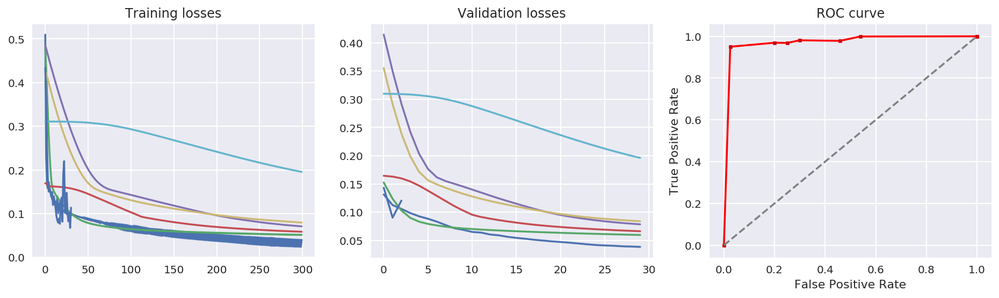


    2 -------------------------- 
    evaluation: 100.00%	(10 over 10)
    mutated: 6/7, 85.71% 
    [#4 / gen 0]	score is 1.0145157761578762
    [#15 / gen 2]	score is 1.4205467294077097
    [#5 / gen 0]	score is 1.4442078116545702
    [#11 / gen 1]	score is 1.7002857828343083
    [#3 / gen 0]	score is 1.8279231577224635
    [#20 / gen 3]	score is 4000
    [#21 / gen 3]	score is 4000
    [#22 / gen 3]	score is 9223372036854775807
    [#23 / gen 3]	score is 9223372036854775807
    [#24 / gen 3]	score is 9223372036854775807
    (9,) (9,)
    


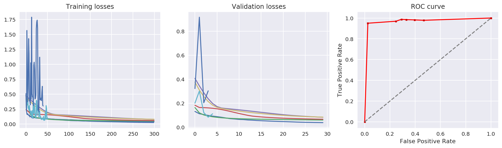


    3 -------------------------- 
    evaluation: 100.00%	(10 over 10)
    mutated: 6/7, 85.71% 
    [#4 / gen 0]	score is 1.0145157761578762
    [#23 / gen 3]	score is 1.309597647227228
    [#15 / gen 2]	score is 1.4360390982288402
    [#5 / gen 0]	score is 1.4471282880647391
    [#11 / gen 1]	score is 1.6010106443406058
    [#25 / gen 4]	score is 1.9502633887053569
    [#26 / gen 4]	score is 4000
    [#27 / gen 4]	score is 9223372036854775807
    [#28 / gen 4]	score is 9223372036854775807
    [#29 / gen 4]	score is 9223372036854775807
    (9,) (9,)
    


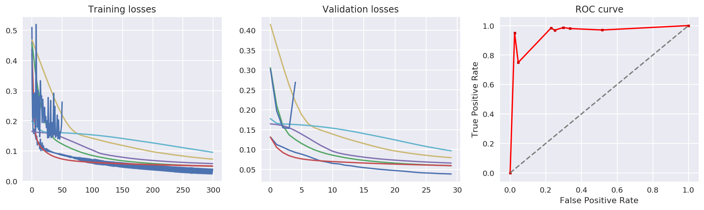


    4 -------------------------- 
    evaluation: 100.00%	(10 over 10)
    mutated: 6/7, 85.71% 
    [#4 / gen 0]	score is 1.0145157761578762
    [#29 / gen 4]	score is 1.0633801904385187
    [#23 / gen 3]	score is 1.20540821336635
    [#15 / gen 2]	score is 1.3169194114579559
    [#5 / gen 0]	score is 1.4423735128352668
    [#30 / gen 5]	score is 1.8036142903260504
    [#31 / gen 5]	score is 2.1057789400308042
    [#32 / gen 5]	score is 9223372036854775807
    [#33 / gen 5]	score is 9223372036854775807
    [#34 / gen 5]	score is 9223372036854775807
    (9,) (9,)
    


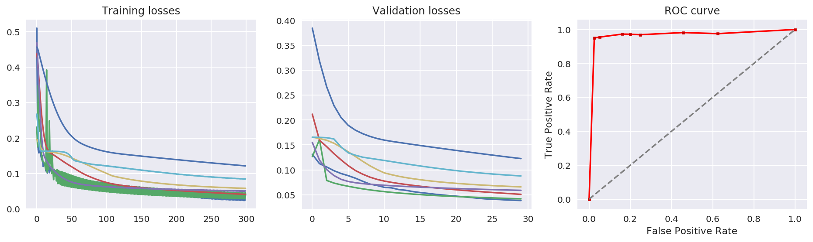


    5 -------------------------- 
    evaluation: 100.00%	(10 over 10)
    mutated: 6/7, 85.71% 
    [#4 / gen 0]	score is 1.0145157761578762
    [#23 / gen 3]	score is 1.1465085359755225
    [#33 / gen 5]	score is 1.2402789267108096
    [#36 / gen 6]	score is 1.2560115546802173
    [#15 / gen 2]	score is 1.335720213720657
    [#34 / gen 5]	score is 1.4746460578862832
    [#35 / gen 6]	score is 1.9471293679731971
    [#37 / gen 6]	score is 9223372036854775807
    [#38 / gen 6]	score is 9223372036854775807
    [#39 / gen 6]	score is 9223372036854775807
    (9,) (9,)
    


    6 -------------------------- 
    evaluation: 100.00%	(10 over 10)
    mutated: 6/7, 85.71% 
    [#4 / gen 0]	score is 1.0145157761578762
    [#36 / gen 6]	score is 1.050027398855435
    [#33 / gen 5]	score is 1.1451629677839013
    [#40 / gen 7]	score is 1.183903231779731
    [#23 / gen 3]	score is 1.2024400087233564
    [#15 / gen 2]	score is 1.4242789326121037
    [#41 / gen 7]	score is 4000
    [#42 / gen 7]	score is 9223372036854775807
    [#43 / gen 7]	score is 9223372036854775807
    [#44 / gen 7]	score is 9223372036854775807
    (9,) (9,)
    


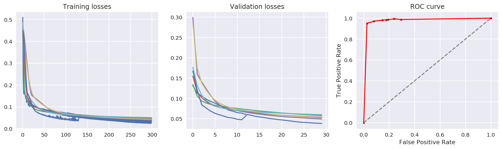


    7 -------------------------- 
    evaluation: 100.00%	(10 over 10)
    mutated: 6/7, 85.71% 
    [#36 / gen 6]	score is 1.0075670647512458
    [#4 / gen 0]	score is 1.0145157761578762
    [#23 / gen 3]	score is 1.2073336166434292
    [#33 / gen 5]	score is 1.2283045476332666
    [#40 / gen 7]	score is 1.2603829352590514
    [#45 / gen 8]	score is 4000
    [#46 / gen 8]	score is 4000
    [#47 / gen 8]	score is 9223372036854775807
    [#48 / gen 8]	score is 9223372036854775807
    [#49 / gen 8]	score is 9223372036854775807
    (9,) (9,)
    


    8 -------------------------- 
    evaluation: 100.00%	(10 over 10)
    mutated: 6/7, 85.71% 
    [#36 / gen 6]	score is 1.0075670647512458
    [#40 / gen 7]	score is 1.1357412079322107
    [#33 / gen 5]	score is 1.1916633525607951
    [#23 / gen 3]	score is 1.2356456985772066
    [#50 / gen 9]	score is 1.3953487064539125
    [#48 / gen 8]	score is 1.408145447905593
    [#51 / gen 9]	score is 2.5378453736569617
    [#52 / gen 9]	score is 9223372036854775807
    [#53 / gen 9]	score is 9223372036854775807
    [#54 / gen 9]	score is 9223372036854775807
    (9,) (9,)
    


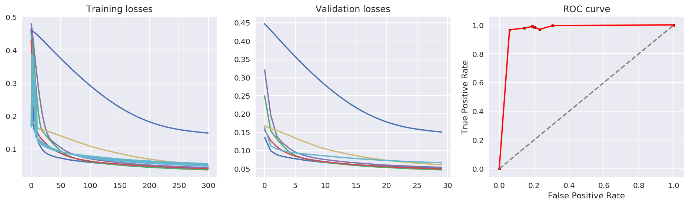


    9 -------------------------- 
    evaluation: 100.00%	(10 over 10)
    mutated: 6/7, 85.71% 
    [#36 / gen 6]	score is 1.0075670647512458
    [#40 / gen 7]	score is 1.1470968361894898
    [#48 / gen 8]	score is 1.2387260056329574
    [#33 / gen 5]	score is 1.2454051020539647
    [#23 / gen 3]	score is 1.2670088805941186
    [#55 / gen 10]	score is 4000
    [#56 / gen 10]	score is 4000
    [#57 / gen 10]	score is 9223372036854775807
    [#58 / gen 10]	score is 9223372036854775807
    [#59 / gen 10]	score is 9223372036854775807
    (9,) (9,)
    


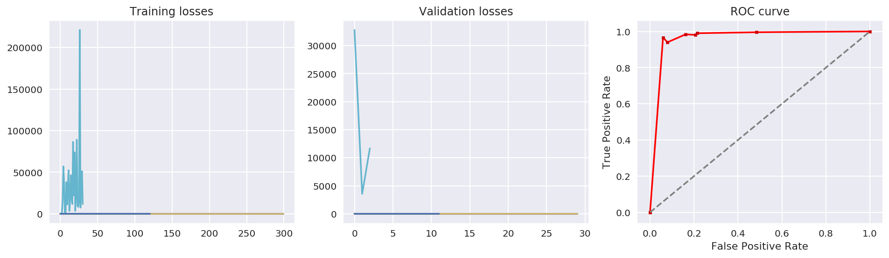


    evaluation: 100.00%	(10 over 10)
    


    <IPython.core.display.Javascript object>


### Display the best player in the game


```python
elite = ev.elite
elite.obj.display_losses()
elite.obj.display_metrics()
plt.show()

print(elite)
print("\t\ttrain_loss", elite.obj.train_losses[-1])
print("\t\tvalidation_loss", elite.obj.validation_losses[-1])
```


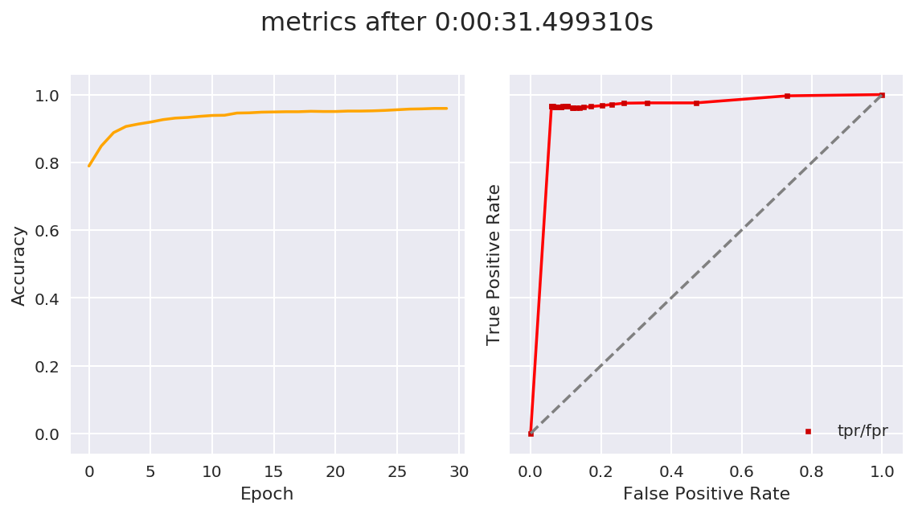


    [#36 / gen 6]	score is 1.0075670647512458
    		train_loss 0.042392105
    		validation_loss 0.051399972
    

Hyperparameters:


```python
elite.dna
```


    {'activation': 'tanh',
     'hidden_layers': 2,
     'hidden_size': 4,
     'learning_rate': 0.014944039906429497,
     'lr_decay': 0.009986286714288355,
     'momentum': 0.5189906057750004}


Test the accuracy and get the metrics:


```python
elite.obj.test(X_test, y_test)
```


    {'accuracy': 0.9591174561972745,
     'error': 0.04088254380272549,
     'false_negative': 37,
     'false_positive': 26,
     'false_positive_rate': 0.05909090909090909,
     'true_negative': 414,
     'true_positive': 1064,
     'true_positive_rate': 0.9663941871026339}


Fitness score composition:


```python
analyze_fitness_components(elite.obj)
```


<div>
<style scoped>
    .dataframe tbody tr th:only-of-type {
        vertical-align: middle;
    }

    .dataframe tbody tr th {
        vertical-align: top;
    }

    .dataframe thead th {
        text-align: right;
    }
</style>
<table border="1" class="dataframe">
  <thead>
    <tr style="text-align: right;">
      <th></th>
      <th>accuracy_emphasized</th>
      <th>mean_epoch_time</th>
      <th>train_loss</th>
      <th>validation_loss</th>
    </tr>
  </thead>
  <tbody>
    <tr>
      <th>value</th>
      <td>0.808777</td>
      <td>0.104998</td>
      <td>0.0423921</td>
      <td>0.0514</td>
    </tr>
    <tr>
      <th>fitness</th>
      <td>1.14085</td>
      <td>1.14085</td>
      <td>1.14085</td>
      <td>1.14085</td>
    </tr>
    <tr>
      <th>percentage</th>
      <td>70.9%</td>
      <td>9.2%</td>
      <td>3.7%</td>
      <td>4.5%</td>
    </tr>
  </tbody>
</table>
</div>


### Analyze how parameters influences

The visual analysis will help us to understand which values were generated and how they are **correlated** to the success of the fitness score.
Each color represent a different model. Each point is bigger when its individual is from a recent generation: hopefully we should see bigger circles on the left, where the score is good, than on the right. The elite is shown by the star icon.


```python
ev.visual_analysis()
```


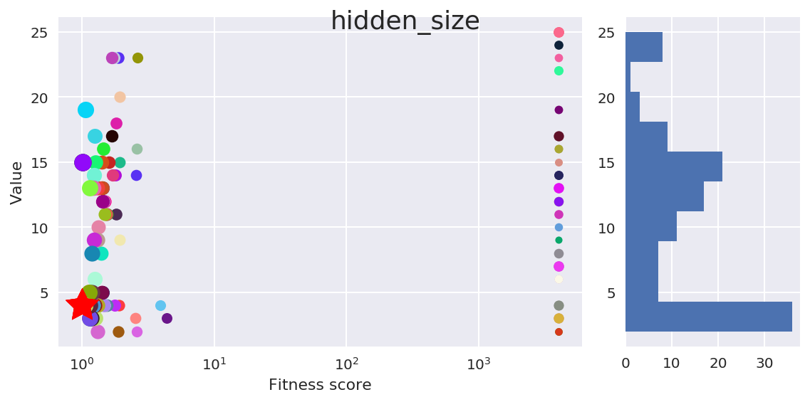


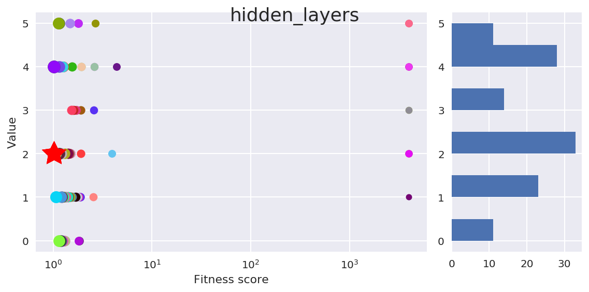


As we can see, the `learning_rate` and the `lr_decay` are always a really low values and we could definitively lower the maximum pickable value. However, it is interesting to see that a value like the `hidden_size` has been tested through a lot of different possibilities.   
The fact that we don't have the distribution of every parameter around the values of the elite components **shows the sanity of the genetic algorithm**. However, we lack of time information and the genetic algorithm may be blocked into a local minimum.  

## Final training on the entire dataset
Now that we have our best model, we can try to train it on the whole dataset. As a reminder, we did used only 10% of the dataset in order to speed up the training, validation and test, and so the genetic evolution.  


```python
ALL_X_train, ALL_y_train, ALL_X_val, ALL_y_val, ALL_X_test, ALL_y_test = cross_validation_split(X_all, y_all)
```

    X_.shape	 (7707, 5971) 	 y_.shape	 (7707, 2)
    X_train.shape	 (4624, 5971) 	 y_train.shape	 (4624, 2)
    X_val.shape	 (1541, 5971) 	 y_val.shape	 (1541, 2)
    X_test.shape	 (1541, 5971) 	 y_test.shape	 (1541, 2)
    

Here are the *best* hyperparameters, according to the genetic evolution: 


```python
optimal_hyperparameters = elite.dna
optimal_hyperparameters
```


    {'activation': 'tanh',
     'hidden_layers': 2,
     'hidden_size': 4,
     'learning_rate': 0.00549440399064295,
     'lr_decay': 0.009986286714288355,
     'momentum': 0.5189906057750004}


### Launch the training


```python
m2 = Model(**optimal_hyperparameters)
m2.epochs_between_reports = 10
train_losses, val_loss, metrics, t = m2.fit(ALL_X_train, ALL_y_train, ALL_X_val, ALL_y_val, ALL_X_test, ALL_y_test, 
                                            epochs=1000, batch_size=512, early_stopping=False, verbose=True)
```

    epoch #10	loss: 0.0542 / 0.0621	acc: 0.91
    epoch #20	loss: 0.0397 / 0.0495	acc: 0.93
    epoch #30	loss: 0.0318 / 0.0428	acc: 0.94
    epoch #40	loss: 0.0277 / 0.0395	acc: 0.95
    epoch #50	loss: 0.0252 / 0.0373	acc: 0.95
    epoch #60	loss: 0.0234 / 0.0357	acc: 0.95
    epoch #70	loss: 0.0220 / 0.0344	acc: 0.96
    epoch #80	loss: 0.0208 / 0.0334	acc: 0.96
    epoch #90	loss: 0.0198 / 0.0326	acc: 0.96
    epoch #100	loss: 0.0190 / 0.0319	acc: 0.96
    epoch #110	loss: 0.0182 / 0.0312	acc: 0.96
    epoch #120	loss: 0.0175 / 0.0307	acc: 0.96
    epoch #130	loss: 0.0169 / 0.0303	acc: 0.97
    epoch #140	loss: 0.0163 / 0.0299	acc: 0.97
    epoch #150	loss: 0.0158 / 0.0295	acc: 0.97
    epoch #160	loss: 0.0153 / 0.0292	acc: 0.97
    epoch #170	loss: 0.0148 / 0.0289	acc: 0.97
    epoch #180	loss: 0.0144 / 0.0286	acc: 0.97
    epoch #190	loss: 0.0140 / 0.0284	acc: 0.97
    epoch #200	loss: 0.0136 / 0.0283	acc: 0.97
    epoch #210	loss: 0.0132 / 0.0281	acc: 0.97
    epoch #220	loss: 0.0128 / 0.0279	acc: 0.97
    epoch #230	loss: 0.0125 / 0.0278	acc: 0.97
    epoch #240	loss: 0.0122 / 0.0277	acc: 0.97
    epoch #250	loss: 0.0119 / 0.0276	acc: 0.97
    epoch #260	loss: 0.0117 / 0.0275	acc: 0.97
    epoch #270	loss: 0.0116 / 0.0280	acc: 0.97
    epoch #280	loss: 0.0112 / 0.0279	acc: 0.97
    epoch #290	loss: 0.0109 / 0.0278	acc: 0.97
    epoch #300	loss: 0.0107 / 0.0277	acc: 0.97
    epoch #310	loss: 0.0105 / 0.0276	acc: 0.97
    epoch #320	loss: 0.0103 / 0.0275	acc: 0.97
    epoch #330	loss: 0.0101 / 0.0274	acc: 0.97
    epoch #340	loss: 0.0099 / 0.0274	acc: 0.97
    epoch #350	loss: 0.0097 / 0.0273	acc: 0.97
    epoch #360	loss: 0.0096 / 0.0273	acc: 0.97
    epoch #370	loss: 0.0094 / 0.0272	acc: 0.97
    epoch #380	loss: 0.0093 / 0.0272	acc: 0.97
    epoch #390	loss: 0.0092 / 0.0271	acc: 0.97
    epoch #400	loss: 0.0090 / 0.0271	acc: 0.97
    epoch #410	loss: 0.0089 / 0.0271	acc: 0.97
    epoch #420	loss: 0.0088 / 0.0271	acc: 0.97
    epoch #430	loss: 0.0087 / 0.0270	acc: 0.97
    epoch #440	loss: 0.0086 / 0.0270	acc: 0.97
    epoch #450	loss: 0.0085 / 0.0270	acc: 0.97
    epoch #460	loss: 0.0084 / 0.0270	acc: 0.97
    epoch #470	loss: 0.0083 / 0.0270	acc: 0.97
    epoch #480	loss: 0.0082 / 0.0270	acc: 0.97
    epoch #490	loss: 0.0081 / 0.0270	acc: 0.97
    epoch #500	loss: 0.0080 / 0.0270	acc: 0.97
    epoch #510	loss: 0.0079 / 0.0270	acc: 0.97
    epoch #520	loss: 0.0078 / 0.0269	acc: 0.97
    epoch #530	loss: 0.0077 / 0.0269	acc: 0.97
    epoch #540	loss: 0.0077 / 0.0270	acc: 0.97
    epoch #550	loss: 0.0076 / 0.0270	acc: 0.97
    epoch #560	loss: 0.0075 / 0.0270	acc: 0.97
    epoch #570	loss: 0.0074 / 0.0270	acc: 0.97
    epoch #580	loss: 0.0074 / 0.0270	acc: 0.97
    epoch #590	loss: 0.0073 / 0.0270	acc: 0.97
    epoch #600	loss: 0.0072 / 0.0270	acc: 0.97
    epoch #610	loss: 0.0072 / 0.0270	acc: 0.97
    epoch #620	loss: 0.0071 / 0.0270	acc: 0.97
    epoch #630	loss: 0.0070 / 0.0270	acc: 0.97
    epoch #640	loss: 0.0070 / 0.0271	acc: 0.97
    epoch #650	loss: 0.0069 / 0.0271	acc: 0.97
    epoch #660	loss: 0.0069 / 0.0271	acc: 0.97
    epoch #670	loss: 0.0068 / 0.0271	acc: 0.97
    epoch #680	loss: 0.0068 / 0.0271	acc: 0.97
    epoch #690	loss: 0.0067 / 0.0271	acc: 0.97
    epoch #700	loss: 0.0066 / 0.0271	acc: 0.97
    epoch #710	loss: 0.0066 / 0.0272	acc: 0.97
    epoch #720	loss: 0.0065 / 0.0272	acc: 0.97
    epoch #730	loss: 0.0065 / 0.0272	acc: 0.97
    epoch #740	loss: 0.0064 / 0.0272	acc: 0.97
    epoch #750	loss: 0.0064 / 0.0272	acc: 0.97
    epoch #760	loss: 0.0063 / 0.0272	acc: 0.97
    epoch #770	loss: 0.0063 / 0.0273	acc: 0.97
    epoch #780	loss: 0.0062 / 0.0273	acc: 0.97
    epoch #790	loss: 0.0062 / 0.0273	acc: 0.97
    epoch #800	loss: 0.0093 / 0.0291	acc: 0.97
    epoch #810	loss: 0.0096 / 0.0340	acc: 0.96
    epoch #820	loss: 0.0083 / 0.0283	acc: 0.97
    epoch #830	loss: 0.0080 / 0.0277	acc: 0.97
    epoch #840	loss: 0.0078 / 0.0275	acc: 0.97
    epoch #850	loss: 0.0077 / 0.0274	acc: 0.97
    epoch #860	loss: 0.0077 / 0.0273	acc: 0.97
    epoch #870	loss: 0.0076 / 0.0272	acc: 0.97
    epoch #880	loss: 0.0076 / 0.0272	acc: 0.97
    epoch #890	loss: 0.0075 / 0.0271	acc: 0.97
    epoch #900	loss: 0.0074 / 0.0271	acc: 0.97
    epoch #910	loss: 0.0074 / 0.0270	acc: 0.97
    epoch #920	loss: 0.0074 / 0.0270	acc: 0.97
    epoch #930	loss: 0.0073 / 0.0269	acc: 0.97
    epoch #940	loss: 0.0073 / 0.0269	acc: 0.97
    epoch #950	loss: 0.0072 / 0.0269	acc: 0.97
    epoch #960	loss: 0.0072 / 0.0269	acc: 0.97
    epoch #970	loss: 0.0071 / 0.0268	acc: 0.97
    epoch #980	loss: 0.0071 / 0.0268	acc: 0.97
    epoch #990	loss: 0.0070 / 0.0268	acc: 0.97
    epoch #1000	loss: 0.0070 / 0.0268	acc: 0.97
    


    <IPython.core.display.Javascript object>


```python
m2.display_losses()
m2.display_metrics()
m2.status
```


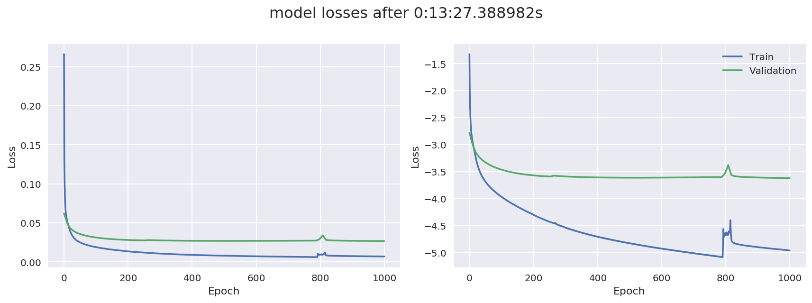


    'live'


```python
m2.test(X_test, y_test)
```


    {'accuracy': 0.9733939000648929,
     'error': 0.026606099935107097,
     'false_negative': 18,
     'false_positive': 23,
     'false_positive_rate': 0.05227272727272727,
     'true_negative': 417,
     'true_positive': 1083,
     'true_positive_rate': 0.9836512261580381}


### Analysis of the results
As said before, the batch_size really influences the precision but also the time took for a model to get a high precision. With the above model, we obtained several accuracies given the batch_size:
- 0.95 (**TPR = 0.974**) with `bath_size = None` (the dataset size, so 7707)
- 0.97 (**TPR = 0.983**) with `batch_size = 512` 
- 0.97 (**TPR = 0.986**) with `batch_size = 32` but it was way longer than the previous one.

The accuracy graph ROC curve really shows how the neural network converges towards a higher rate of True Positives but **can't really go over 99%**. 

# Conclusion

The goal of this project was to build a feed-forward neural network able to classify an input of being a malware or not. We used a genetic algorithm in order to find the best hyperparameters for the model.  
We trained this genetic algorithm through 10 evolutions, each with a population of 10 different models.    

We first did a cross-validation on 10% of the dataset to speed-up the set-up and examine how the genetic evolution can help us. The results were good but and when we finally trained the genetic algorithm on the whole dataset (again, using cross-validation, so the training set was not exactly 100%), the accuracy jumped again.  

The real advantage of the genetic algorithm here was to be able to give an appropriate solution depending on amount of dataset inputs, the batch size (which helped us to speed-up the development of the overall project) and all the possible hyperparameters for this classification problem. In other words, it was **its ability to adapt the models given the environment**, so we didn't have to re-test every combination of parameters each time that we changed something.

>Our results with the best found model reached an accuracy of 0.97 with:
>- 1083 correctly classified as *malwares*, 18 missed (True Positive Rate = 98.36%)
>- 417 correctly classified as *benigns*, 23 missed (False Positive Rate = 5.22%)

### Limitations of the genetic evolution

The randomness of this algorithm which makes its power can also lead to bad results. For example, it is possible to be stuck in a local optimum even if we continue to evolve and mutate the population over 40 generations: this is often due to the first random generation of a too good model which blocks the population to improve itself, even with mutations. There are two options to solve that:
* We can choose, after a given threshold time, to mutate the elite itself (but we may go backwards and lose a good population if no other elites stands out from the crowd)
* Since the crossover is always made with the same elite, we could try to do a crossover with maybe 3 individuals instead of two.

### Possible improvements

One way of improving this model would be to train on more data. As well, the way that we create new models could be also improved: 
* We could set the value a highly-correlated hyperparameter in order to optimize the associated other one. For example, we stabilize the number of hidden layers when we obtain a correct value and then focus on the number of neurons on each layer.
* We could also set the value of hyperparameters like the learning rate and its decay (which was really low in every evolution) in order to give fewer choices and avoid picking randomly non-efficient configurations.
* We could add an option for setting different amount of neurons on each layer and thus to give more freedom (currently, the picked activation function and the hidden size are the same for each hidden layer). 
* When we have our most powerful hyperparameters, we could modify the fitness function and emphasize the time required for the model training, in order to get the most powerful and fastest model. 

The Python implementation of the genetic algorithm may be also improved:
* It could be possible to speed-up the evolution by using multithreading in Python and splitting up a population in as many threads as it contains different models. 
